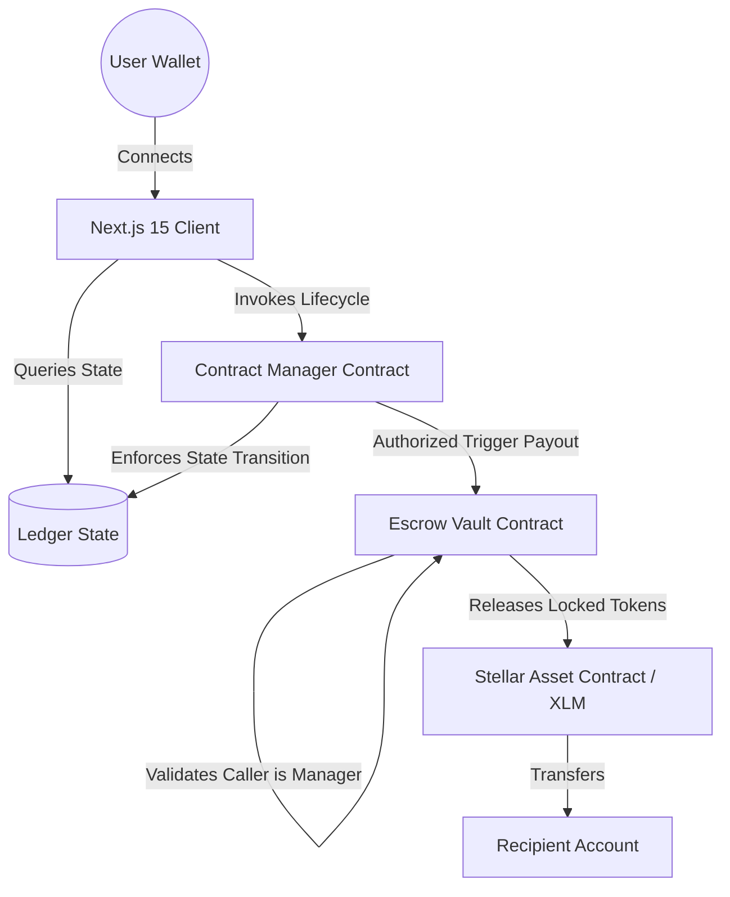
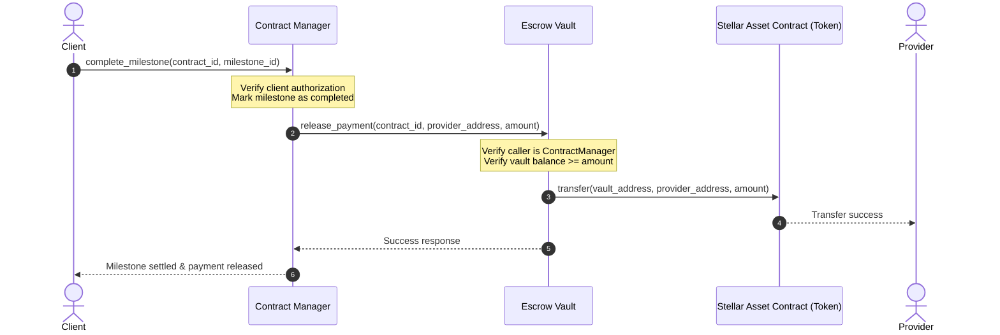

# LexStellar ⚡
### Decentralized Business Contract Automation Platform

LexStellar is a production-grade dApp built on the Stellar blockchain that automates the creation, signature, custody funding, and milestone-based settlement of commercial agreements using Soroban smart contracts.

---

## 🏛️ Product Overview & Problem Statement

Traditional commercial agreements suffer from friction, payment delays, billing overhead, and escrow vulnerability. LexStellar resolves this by replacing manually enforced agreements with modular, self-executing smart contracts.

By separating the **agreement lifecycle** from **financial custody**, LexStellar prevents unauthorized access to escrowed tokens. Payments are only released when milestones are explicitly verified by the client or authorized participants, creating a secure, trustless environment for B2B transactions.

---

## 📊 System Architecture

LexStellar uses a modular **Manager-Vault** architecture to enforce role-based access controls and ensure that financial custody is isolated from agreement state transitions.



### Core Components
1. **Contract Manager**: Orchestrates the agreement state (`Active` -> `Signed` -> `Completed`). Enforces roles, stores milestone lists, and calls the Escrow Vault to release funds upon milestone verification.
2. **Escrow Vault**: Holds client deposits in custody. Employs strict permission rules to ensure only the designated `ContractManager` can execute releases.
3. **Stellar Asset Contract**: Standard Stellar/Soroban token interface used to handle the vault's assets.

---

## 🔗 Inter-Contract Communication Flow

When a client approves a milestone, the inter-contract execution behaves as follows:



---

## 🛡️ Smart Contract Design & Custom Storage

### Custom Storage Structures
The contracts utilize Soroban's native instance storage to store key business structures:
- **`BusinessContract`**: Contains ID, Client address, Provider address, Title, Terms Hash (e.g. IPFS CID), a vector of Milestones, the current state, and the total amount.
- **`Milestone`**: A struct tracking milestone ID, description, payment amount, and completion status.
- **`ContractState`**: An enum mapping `Active` (0), `Signed` (1), `Completed` (2), and `Disputed` (3).

### Access Control & Upgrades Strategy
- **`require_auth()`**: Enforces user authentication for all state-changing transactions.
- **Inter-Contract Permission**: The `EscrowVault` queries the stored `ContractManager` address and compares it with `env.ledger().get_auth_contract()` or validates transaction signatures to ensure that no address other than the verified manager can invoke `release_payment`.
- **Upgrade Strategy**: Smart contracts can employ Soroban's upgradeable contract pattern by implementing a function that calls `env.deployer().update_current_contract_wasm(new_wasm_hash)`, protected by multi-signature admin verification.

---

## ✨ Features

- **Multi-Wallet Support**: Integrated using `@creit.tech/stellar-wallets-kit` supporting Freighter, Albedo, and xBull.
- **Role-Based Workflows**: Tailored buttons and permissions for Clients (fund, complete milestone) and Providers (sign contract).
- **Simulated Testnet Fallback**: Full client-side simulation when contract addresses are set to placeholders, allowing immediate usability.
- **Transaction Center**: Tracking dashboard displaying hashes, timestamps, statuses, and explorer links.
- **Real-Time Stream**: Live blockchain event monitoring for instant UI synchronization.

---

## 🛠️ Tech Stack

- **Smart Contracts**: Rust, Soroban SDK
- **Frontend**: Next.js 16 (App Router), TypeScript
- **Styling**: Tailwind CSS, shadcn/ui
- **State Management**: Zustand
- **Query Cache**: `@tanstack/react-query`
- **Blockchain Interaction**: `stellar-sdk`, `@creit.tech/stellar-wallets-kit`
- **Unit Testing**: Vitest (Frontend), Native Cargo Tests (Rust)

---

## 🔧 Environment Variables

Create a `frontend/.env.local` file with the following variables:

```env
# Stellar Network Configuration
NEXT_PUBLIC_NETWORK=testnet
NEXT_PUBLIC_HORIZON_URL=https://horizon-testnet.stellar.org
NEXT_PUBLIC_SOROBAN_RPC_URL=https://soroban-testnet.stellar.org
NEXT_PUBLIC_NETWORK_PASSPHRASE="Test SDF Network ; September 2015"

# Smart Contract Addresses (Leave as placeholders to run in Simulation Mode)
NEXT_PUBLIC_CONTRACT_MANAGER_ID=CONTRACT_MANAGER_ADDRESS_PLACEHOLDER
NEXT_PUBLIC_ESCROW_VAULT_ID=ESCROW_VAULT_ADDRESS_PLACEHOLDER

# Token Address (Testnet SAC or custom token)
NEXT_PUBLIC_TOKEN_ID=CDLZFC3SYJYDZT7K67VZ75YJBM22KZCHZ3S3YRYZ76TZVAVZ6S6KZCTO
```

---

## 🚀 Local Development

### 1. Smart Contracts Setup (Requires Rust and Stellar CLI)
```bash
# Build contracts
cargo build --target wasm32-unknown-unknown --release

# Run Rust unit/integration tests
cargo test --workspace
```

### 2. Frontend Setup
```bash
cd frontend

# Install dependencies (ignoring local system script warnings)
npm install --ignore-scripts

# Run unit tests
npm run test

# Build for production
npm run build

# Start the dev server
npm run dev
```

---

## 🧪 Testing Architecture

### 1. Smart Contract Tests (`cargo test`)
- **`EscrowVault` Tests ([test.rs](file:///c:/Users/sampa/OneDrive/Desktop/Business%20Contract%20Automation%20Platform/contracts/escrow-vault/src/test.rs))**: Validates the contract vault funding flow, balances, double-init guards, and payments release.
- **`ContractManager` Tests ([test.rs](file:///c:/Users/sampa/OneDrive/Desktop/Business%20Contract%20Automation%20Platform/contracts/contract-manager/src/test.rs))**: Deploys a mock escrow vault to verify the inter-contract triggers upon milestone completions.

### 2. Frontend Tests (`npm run test`)
- **`store.test.ts`**: Verifies transaction state, network configurations, and simulation actions (creation, signing, funding, release).
- **`wallet.test.ts`**: Verifies address connections, disconnections, and contract state caching.
- **`landing.test.tsx`**: Renders the Landing page and CTAs.

---

## 🤖 CI/CD Workflow

LexStellar employs GitHub Actions (`.github/workflows/ci.yml`) to automatically compile contracts and build/test the frontend on Pull Requests and Merges to the `main` branch.

---

## 🔒 Security Considerations

1. **Authorization Verification**: Each client-side method uses `require_auth()` to prevent identity spoofing.
2. **Re-entrancy Protection**: Token transfers are executed *after* internal ledger states are decremented to prevent classic re-entrancy exploits.
3. **Escrow Custody Access**: The vault implements strict verification checking that the caller matches the initialized `ContractManager` address.

---

## 🔗 Metadata & Placeholders

- **Contract Address Manager**: `CONTRACT_ADDRESS_PLACEHOLDER`
- **Transaction Hash**: `TRANSACTION_HASH_PLACEHOLDER`
- **Demo Video**: `DEMO_VIDEO_LINK_PLACEHOLDER`
- **Live Demo**: `LIVE_DEMO_PLACEHOLDER`
